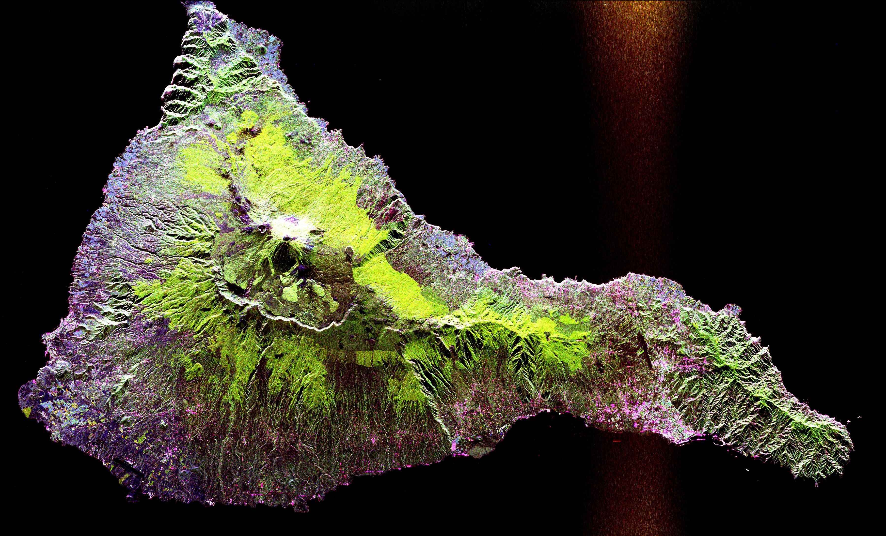

In this essay, we will talk about how to add a picture in blog.

<!--more-->

There are many ways to add a picture, the one to use pure markdown syntax is ``.

Now I will show you a BIG picture (3600x2180):

And a small picture (30x20):

Here is a inline markdown mark .

